# 1. 关键字

关键字是编程语言里事先定义好并赋予了特殊含义的单词，也称作保留字。和其它语言一样，Java 中保留了许多关键字，例如，class、public 等，下面列举的是 Java 中所有的关键字。

## 1.1 关键字概述

被 Java 语言赋予特定含义的单词

## 1.2 关键字特点

组成关键字的字母全部小写

## 1.3 关键字注意事项

- goto 和 const 作为保留字存在,目前并不使用
- 类似 Notepad++这样的高级记事本,针对关键字有特殊的颜色标记，非常直观

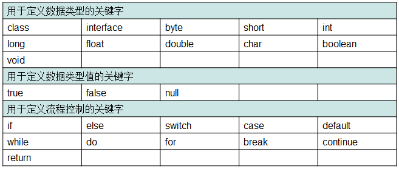

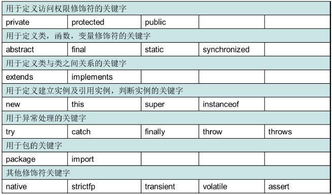

# 2. 标识符

## 2.1 标识符概述

就是给类，接口，方法，变量等起名字时使用的字符序列

## 2.2 组成规则

由英文大小写字母、数字字符、\$（美元符号）、\_（下划线）组成

## 2.3 注意事项

- 不能以数字开头
- 不能是 Java 中的关键字
- 区分大小写

## 2.4 标识符常见命名规则：见名知意

### 2.4.1 包

其实就是文件夹，用于把相同的类名进行区分，全部小写，单级：utils，多级：utils.math

为了便于对硬盘上的文件进行管理，通常都会将文件分目录进行存放。同理，在程序开发中，也需要将编写的类在项目中分目录存放，以便于文件管理。为此，Java 引入了包(package)机制，程序可以通过声明包的方式对 Java 类定义目录。

Java 中的包是专门用来存放类的，通常功能相同的类存放在相同的包中。在声明包时，使用 package 语句，具体示例如下：

```java
package cn.itcast.chapter01; // 使用package关键字声明包
public class Example01{…}
```

需要注意的是，包的声明只能位于 Java 源文件的第一行。

在实际程序开发过程中，定义的类都是含有包名的，如果没有显式地声明 package 语句，创建的类则处于默认包下，在实际开发中，这种情况是不应该出现的，本教材的示例代码主要展现的是功能部分的代码，所以在大多数示例代码中没有为示例指定包名，但是在提供的源码中，都已使用包名。

在开发时，一个项目中可能会使用很多包，当一个包中的类需要调用另一个包中的类时，就需要使用 import 关键字引入需要的类。使用 import 可以在程序中一次导入某个指定包下的类，这样就不必在每次用到该类时都书写完整类名，简化了代码量。使用 import 关键字的具体格式如下所示：

```java
import 包名.类名;
```

需要注意的是，import 通常出现在 package 语句之后，类定义之前。如果有时候需要用到一个包中的许多类，则可以使用 `import 包名.*;` 来导入该包下所有类。

在 JDK 中，不同功能的类都放在不同的包中，其中 Java 的核心类主要放在 java 包及其子包下，Java 扩展的大部分类都放在 javax 包及其子包下。为了便于后面的学习，接下来简单介绍 Java 语言中的常用包。

- java.util:包含 Java 中大量工具类、集合类等，例如 Arrays、List、Set 等。
- java.net:包含 Java 网络编程相关的类和接口。
- java.io:包含了 Java 输入、输出有关的类和接口。
- java.awt:包含用于构建图形界面(GUI)的相关类和接口。

除了上面提到的常用包，JDK 中还有很多其它的包，比如数据库编程的 java.sql 包，编写 GUI 的 javax.swing 包等等，JDK 中所有包中的类构成了 Java 类库。在以后的章节中，这些包中的类和接口将逐渐介绍，这里只需要有个大致印象即可。

### 2.4.2 类或者接口

一个单词：单词的首字母必须大写，举例：Student,Dog
多个单词：每个单词的首字母必须大写举例：HelloWorld，StudentName

### 2.4.3 方法和变量

一个单词：单词的首字母小写，举例：main,age
多个单词：从第二个单词开始，每个单词的首字母大写，举例：studentAge,showAllNames()

### 2.4.4 常量

一个单词：全部大写，举例：PI
多个单词：每个字母都大写，用\_隔开，举例：STUDENT_MAX_AGE

# 3. 注释

## 3.1 注释概述

用于解释说明程序的文字

## 3.2 Java 中注释分类格式

- 单行注释，格式： `//注释文字`
- 多行注释，格式： `/* 注释文字 */`
- 文档注释，格式：`/** 注释文字 */`

```java
/*
    注释：用于解释说明程序的文字

	Java中注释的分类及格式
        单行注释：//
		多行注释：/星 星/
			注意：多行不可以嵌套使用，而单行是可以的
		文档注释：被javadoc工具解析生成一个说明书，面向对象部分讲解。
*/

//这是我的注释案例
class ZhuShiDemo {
	//main方法是主方法
	//是程序的入口
	//被jvm调用
	public static void main(String[] args) {
		System.out.println("好好学习,天天向上");
	}
}
```

- 对于单行和多行注释，被注释的文字，不会被 JVM（java 虚拟机）解释执行
- 对于文档注释，是 java 特有的注释，其中注释内容可以被 JDK 提供的工具 javadoc 所解析，生成一套以网页文件形式体现的该程序的说明文档
- 注释是一个程序员必须要具有的良好编程习惯
- 初学者编写程序可以养成习惯：先写注释再写代码
- 将自己的思想通过注释先整理出来，在用代码去体现
- 因为代码仅仅是思想的一种体现形式而已

```java
/*
	需求：我准备写一个java程序，把"HelloWorld"这句话输出在控制台

	分析：
		A:要写一个Java程序，必须定义类
		B:把数据能够输出，说明我们的程序是可以独立运行的，而程序要独立运行，必须定义main方法
		C:把数据输出在控制台，必须使用输出语句

	实现：
		A:java语言提供了一个关键字：class用来定义类，后面跟的是类名
		B:main方法的格式是固定的：
			public static void main(String[] args) {

			}
		C:输出语句的格式是固定的：
			System.out.println("HelloWorld");
			"HelloWorld"这个内容是可以改变的
*/

//这是我的HelloWorld案例
class HelloWorld {
	/*
		为了程序能够独立运行，定义main方法
		main方法是程序的入口
		被jvm自动调用
	*/
	public static void main(String[] args) {
		//为了把数据显示在控制台，我们就使用了输出语句
		System.out.println("HelloWorld");
	}
}
```

# 4. 常量、进制和进制转换

## 4.1 常量概述

在程序执行的过程中其值不可以发生改变

## 4.2 Java 中常量分类

### 4.2.1 字面值常量

- 字符串常量：用双引号括起来的内容，举例：“hello”，“world”
- 整数常量：所有整数，举例：12，23
- 小数常量：所有小数，举例：12.34，56.78
- 字符常量：用单引号括起来的内容，举例：‘a’,’A’,’0’
- 布尔常量，较为特有，举例：true，false
- 空常量，举例：null

### 4.2.2 自定义常量

```java
/*
	常量：
		在程序执行过程中，其值不发生改变的量。

	分类：
		A:字面值常量
		B:自定义常量(后面讲)

	字面值常量
		A:字符串常量	用双引号括起来的内容。
			举例："hello","world","HelloWorld"
		B:整数常量	所有的整数
			举例：100,200
		C:小数常量	所有的小数
			举例：10.23,110.11
		D:字符常量	用单引号括起来的内容
			举例：'a','A','0'
			错误的：'ab'
		E:布尔常量	比较特殊
			举例：true,false
		F:空常量	后面讲
			举例：null
*/
class ConstantDemo {
	public static void main(String[] args) {
		//字符串常量的输出
		System.out.println("hello");

		//整数常量的输出
		System.out.println(100);

		//小数常量的输出
		System.out.println(100.10);

		//字符常量的输出
		System.out.println('a');
		System.out.println('A');
		System.out.println('0');
		//这个是有问题的
		//System.out.println('ab');

		//布尔常量的输出
		System.out.println(true);
		System.out.println(false);
	}
}
```

## 4.3 Java 针对整数常量提供了 4 种表现形式

二进制，八进制，十进制，十六进制

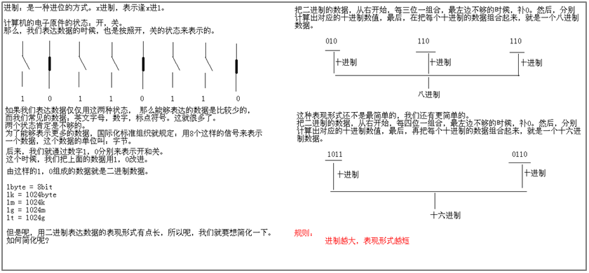

## 4.4 进制概述

进制：就是进位制，是人们规定的一种进位方法。 对于任何一种进制--X 进制，就表示某一位置上的数运算时是逢 X 进一位。二进制就是逢二进一，八进制是逢八进一，十进制是逢十进一，十六进制是逢十六进一。

PS：
二进制的由来：任何数据在计算机中都是以二进制的形式存在的。二进制早期由电信号开关演变而来。

一个整数在内存中一样也是二进制的，但是使用一大串的 1 或者 0 组成的数值进行使用很麻烦。所以就想把一大串缩短点，将二进制中的三位用一位表示。这三位可以取到的最大值就是 7 超过 7 就进位了，这就是八进制。但是对于过长的二进制变成八进制还是较长，所以出现的用 4 个二进制位表示一位的情况，四个二进制位最大是 15，这就是十六进制。

规律：进制越大，表现形式越短。

## 4.5 不同进制的数据组成

- 二进制，由 0，1 组成。以 0b 开头
- 八进制，由 0，1，…7 组成。以 0 开头
- 十进制，由 0，1，…9 组成。整数默认是十进制的
- 十六进制，由 0，1，…9，a，b，c，d，e，f(大小写均可)。以 0x 开头

```java
/*
	不同进制的数据表现：
		二进制：由0，1组成。以0b开头。
		八进制：由0,1,...7组成。以0开头。
		十进制：由0,1,...9组成。默认整数是十进制。
		十六进制：由0,1,...9,a,b,c,d,e,f(大小写均可)组成。以0x开头。
*/
class JinZhiDemo {
	public static void main(String[] args) {
		System.out.println(100); //十进制

		System.out.println(0b100); //二进制
		System.out.println(0100); //八进制
		System.out.println(0x100); //十六进制
	}
}
```

运行结果


## 4.6 进制转换

- 其他进制到十进制

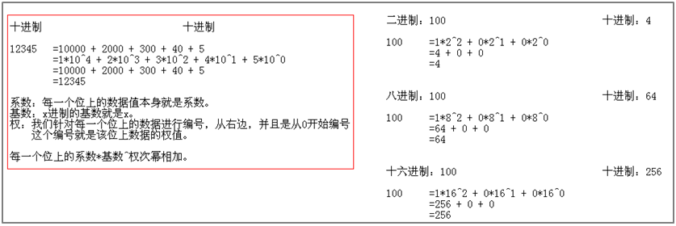

- 十进制到其他进制

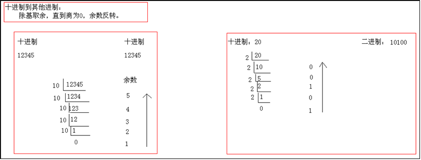

- 十进制和二进制的快速转换，8421 码，也叫 BCD 码

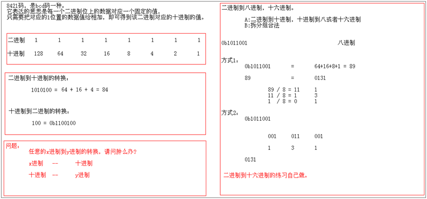

- 二进制和八进制，十六进制如何转换
  以十进制作为桥梁，二进制到八进制 3 位组合，二进制到十六进制 4 位组合

PS：
1、其他进制到十进制

- 系数：就是每一位上的数据
- 基数：X 进制，基数就是 X
- 权：在右边，从 0 开始编号，对应位上的编号即为该位的权
- 结果：把系数\*基数的权次幂相加即可

2、十进制到其他进制
除基取余，直到商为 0，余数反转。

## 4.7 有符号数据表示法

在计算机内，有符号数有 3 种表示法：原码、反码和补码。所有数据的运算都是采用补码进行的

- 原码：就是二进制定点表示法，即最高位为符号位，“0”表示正，“1”表示负，其余位表示数值的大小
- 反码：正数的反码与其原码相同；负数的反码是对其原码逐位取反，但符号位除外
- 补码：正数的补码与其原码相同；负数的补码是在其反码的末位加 1

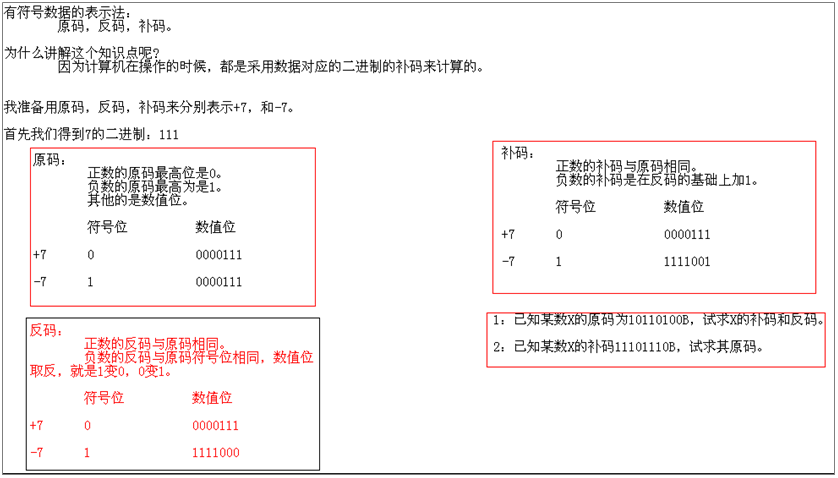

## 4.8 练习

### 4.8.1 得到下面数据的十进制值

```
0b10101
   =12^4 + 12^2 + 1*2^0
   =16 + 4 + 1
   =21

0123
   =18^2 + 28^1 + 3*8^0
   =64 + 16 + 3
   =83

0x3c
   =316^1 + c16^0
   =48 + 12
   =60
```

### 4.8.2 得到下面数据的二进制，十进制，十六进制

52 分别得到二进制，十进制，十六进制

得到二进制：

```
   52 / 2 = 26      0
   26 / 2 = 13      0
   13 / 2 = 6       1
   6  / 2 = 3       0
   3  / 2 = 1       1
   1  / 2 = 0       1
   0b110100
```

得到八进制：

```
   52 / 8 = 6     4
   6  / 8 = 0    6
   064
```

得到十六进制：

```
   52 / 16 = 3   4
   3  / 16 = 0  3
   0x34
```

### 4.8.3 有符号数据表示法的练习

A：已知某数 X 的原码为 10110100B，试求 X 的补码和反码。

符号位 数值位
原码：10110100
反码：11001011
补码：11001100

B:已知某数 X 的补码 11101110B，试求其原码

符号位 数值位
补码： 11101110
反码： 11101101
原码： 10010010

# 5. 变量

在程序运行期间，随时可能产生一些临时数据，应用程序会将这些数据保存在一些内存单元中，每个内存单元都用一个标识符来标识。这些内存单元我们称之为变量，定义的标识符就是变量名，内存单元中存储的数据就是变量的值。

## 5.1 变量概述

在程序执行的过程中，在某个范围内其值可以发生改变的量，理解：如同数学中的未知数

## 5.2 变量定义格式

数据类型 变量名 = 初始化值;
注意：格式是固定的，记住格式，以不变应万变

## 5.3 变量的组成规则

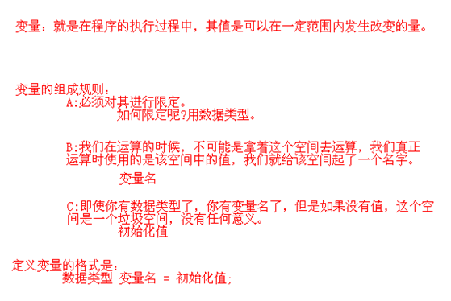

1、从本质上讲，变量其实是内存中的一小块区域，使用变量名来访问这块区域，因此，每一个变量使用前必须要先申请（声明），然后必须进行赋值（填充内容），才能使用。通过画图说明一个变量的组成部分

数据类型，变量名，变量值

2、为什么要定义变量呢?用来不断的存放同一类型的常量，并可以重复使用

# 6. 数据类型和类型转换

Java 是一门强类型的编程语言，它对变量的数据类型有严格的限定。在定义变量时必须声明变量的类型，在为变量赋值时必须赋予和变量同一种类型的值，否则程序会报错。

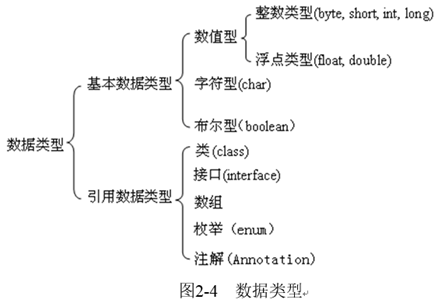

## 6.1 数据类型

6.1.1 Java 语言是强类型语言，对于每一种数据都定义了明确的具体数据类型，在内存总分配了不同大小的内存空间

6.1.2 所谓有效数字：具体地说，是指在分析工作中实际能够测量到的数字。所谓能够测量到的是包括最后一位估计的，不确定的数字。对于一个近似数，从左边第一个不是 0 的数字起，到精确到的位数止，所有的数字都叫做这个数的有效数字。

6.1.3 Java 各整数类型有固定的表数范围和字段长度，其不受具体操作系统的影响，以保证 Java 程序的可移植性。

- Java 语言的整型常量默认为 int 型，声明 long 型常量可以后加‘ l ’或‘ L ’ ，如：

  int i1 = 600; //正确 long l1 = 88888888888L; //必须加 l 否则会出错

- 与整数类型类似，Java 浮点类型有固定的表数范围和字段长度，不受平台影响。

  Java 浮点类型常量有两种表示形式，十进制数形式，如: 3.14 314.0

- 科学记数法形式，如 3.14e2 3.14\*10^2

- Java 浮点型常量默认为 double 型，如要声明一个常量为 float 型，则需在数字后面加 f 或 F ，如：

  double d = 12345.6; //正确 float f = 12.3f; //必须加 f 否则会出错

- char 型数据用来表示通常意义上的“字符”

  - 字符常量为用单引号括起来的单个字符，例如：char ch1= 'a'; char ch2='中';
  - Java 字符采用 Unicode 编码，每个字符占两个字节，因而可用十六进制编码形式表示。
  - 注：Unicode 是全球语言统一编码

* boolean 类型适于逻辑运算，一般用于程序流程控制 。
* boolean 类型数据只允许取值 true 或 false ，不可以 0 或非 0 的整数替代 true 和 false ，这点和 C 语言不同。
* 数据类型
  - 基本数据类型：整型 byte、short、int、long，浮点型 float、double，字符型 char，布尔型 boolean
  - 引用数据类型：类 class、接口 interface、数组[]


```Java
/*
	数据类型：Java是一种强类型的语言，针对每一种数据都定义了明确的数据类型。

	数据类型分类：
		A:基本数据类型
		B:引用数据类型(类,接口,数值)

	基本数据类型:4类8种
		A:整数			占用字节数
			byte			1
			short			2
			int				4
			long			8

		B:浮点数
			float 			4
			double 			8

		C:字符
			char			2
		D:布尔
			boolean			1

		注意：
			整数默认是int类型
			浮点数默认是double类型。

			长整型后缀用L或者l标记。建议使用L。
			单精度浮点数用F或者f标记。建议使用F。
*/
class DataTypeDemo {
	public static void main(String[] args) {
		//定义变量的格式：
		//数据类型 变量名 = 初始化值;

		//定义一个字节变量
		byte b = 10;
		System.out.println(10);
		System.out.println(b);

		//定义一个短整型变量
		short s = 100;
		System.out.println(s);

		//定义一个整型变量
		int i = 1000;
		System.out.println(i);

		//超过了int的范围
		//int j = 1000000000000;
		long j = 1000000000000L;
		//long j = 100L;
		System.out.println(j);

		//定义浮点数据变量
		float f = 12.345F;
		System.out.println(f);

		double d = 12.345;
		System.out.println(d);

		//定义字符变量
		char ch = 'a';
		System.out.println(ch);

		//定义布尔变量
		boolean flag = true;
		System.out.println(flag);
	}
}
```

运行结果:


6.1.4 使用变量的时候要注意的问题：

A：作用域
变量定义在哪个大括号内，它就在这个大括号内有效。
并且，在同一个大括号内不能同时定义同名的变量。

B：初始化值
没有初始化值的变量不能直接使用。
你只要在使用前给值就行，不一定非要在定义的时候立即给值。
推荐在定义的时候给值。

定义变量的格式：
a：数据类型 变量名 = 初始化值;
b：数据类型 变量名;
变量名 = 初始化值;
C：在一行上建议只定义一个变量
可以定义多个，但是不建议

## 6.2 类型转换

当把一种数据类型的值赋给另一种数据类型的变量时，需要进行数据类型转换。

根据转换方式的不同，数据类型转换可分为两种：自动类型转换和强制类型转换。

### 6.2.2 默认转换(从小到大的转换)

自动类型转换也叫隐式类型转换，指的是两种数据类型在转换的过程中不需要显式地进行声明。

要实现自动类型转换，必须同时满足两个条件，

- 第一是两种数据类型彼此兼容，
- 第二是目标类型的取值范围大于源类型的取值范围。

（1）整数类型之间可以实现转换，如 byte 类型的数据可以赋值给 short、int、long 类型的变量，short、char 类型的数据可以赋值给 int、long 类型的变量，int 类型的数据可以赋值给 long 类型的变量
（2）整数类型转换为 float 类型，如 byte、char、short、int 类型的数据可以赋值给 float 类型的变量。
（3）其它类型转换为 double 类型，如 byte、char、short、int、long、float 类型的数据可以赋值给 double 类型的变量。

A：byte，short，char—int—long—float—double

B：byte，short，char 相互之间不转换，他们参与运算首先转换为 int 类型

### 6.2.2 强制转换：

强制类型转换也叫显式类型转换，指的是两种数据类型之间的转换需要进行显式地声明。

当两种类型彼此不兼容，或者目标类型取值范围小于源类型时，自动类型转换无法进行，这时就需要进行强制类型转换。

从大的数据类型到小的数据类型
格式：目标数据类型 变量 = (目标数据类型) (被转换的数据);
注意：不要随意的去使用强制转换，因为它隐含了精度损失问题

```java
/*
	面试题：
		byte b1=3,b2=4,b;
		b=b1+b2;
		b=3+4;
		哪句是编译失败的呢？为什么呢？
		b = b1 + b2;是有问题的。
		因为变量相加，会首先看类型问题，最终把结果赋值的也会考虑类型问题。
		常量相加，首先做加法，然后看结果是否在赋值的数据类型范围内，如果不是，才报错。
*/
class DataTypeDemo6 {
	public static void main(String[] args) {
		//定义了三个byte类型的变量，b1，b2，b3
		//b1的值是3，b2的值是4，b没有值
		byte b1 = 3,b2 = 4,b;

		//b = b1 + b2; //这个是类型提升，所有有问题

		b = 3 + 4; //常量，先把结果计算出来，然后看是否在byte的范围内，如果在就不报错。
	}
}
```

1、在定义 Long 或者 Float 类型变量的时候，要加 L 或者 f。

- 整数默认是 int 类型，浮点数默认是 double。
- byte，short 在定义的时候，他们接收的其实是一个 int 类型的值。
- 这个是自己做了一个数据检测的，如果不再它们的范围内，就报错。

2、byte 值的问题

```java
byte b1 = 127;
byte b2 = (byte)128; //-128
byte b3 = (byte)129; //-127
byte b4 = (byte)130; //-126
byte的范围：-128 ~ 127
128：10000000
-128：10000000 (这里的1即是符号位，也是数值位)
```

3、数据类型转换之默认转换
byte，short，char -- int -- long -- float -- double
long：8 个字节
float：4 个字节
A：它们底层的存储结构不同
B：float 表示的数据范围比 long 的范围要大
long：2^63-1
float：3.4\*10^38 > 2\*10^38 > 2\*8^38 = 2\*2^3^38 = 2\*2^114 > 2^63-1

4、Java 语言中的字符 char 可以存储一个中文汉字吗?为什么呢?
可以。因为 java 语言中的字符占用两个字节。Java 语言采用的是 Unicode 编码。

# 7. 运算符

## 7.1 运算符

- 运算：对常量和变量进行操作的过程称为运算。
- 运算符：对常量和变量进行操作的符号称为运算符
- 操作数：参与运算的数据称为操作数
- 用运算符把常量或者变量连接起来符号 java 语法的式子就可以称为表达式。
  不同运算符连接的式子体现的是不同类型的表达式。

举例：int a = 3 + 4;
这是做了一个加法运算，+就是运算符，是算术运算符，我们还有其他很多的运算符，3 和 4 就是参与运算的操作数据，3 + 4 整体其实就是一个算数表达式

## 7.2 算术运算符

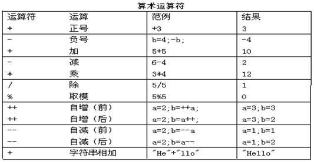

除法的时候要注意一个问题，整数相除，只能得到整数，要想得到小数，可以\*1.0

- ++和--的应用
  单独使用：放在操作数的前面和后面效果一样。(这种用法是我们比较常见的)
  参与运算使用：放在操作数的前面，先自增或者自减，然后再参与运算；放在操作数的后面，先参与运算，再自增或者自减。
  作用：就是对变量进行自增 1 或者自减 1。
- +的用法：加法，正号，字符串连接符
- 运算符的优先级（由高到低）

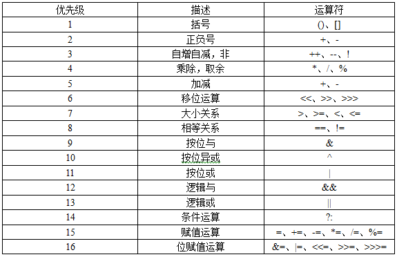

## 7.3 赋值运算符

基本的赋值运算符：=，把=右边的数据赋值给左边。
扩展的赋值运算符：+=、-=，\*=，/=，%=，+= 把左边和右边做加法，然后赋值给左边。

## 7.4 关系运算符

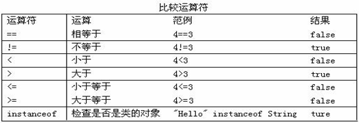

- 比较运算符的结果都是 boolean 型，也就是要么是 true，要么是 false。
- 比较运算符“==”不能误写成“=”

## 7.5 逻辑运算符

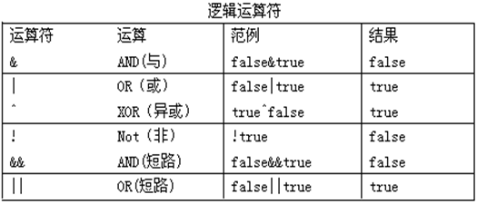

- 逻辑运算符用于连接布尔型表达式，在 Java 中不可以写成 `3<x<6`，应该写成 x>3 & x<6 。
- “&”和“&&”的区别
  - 单&时，左边无论真假，右边都进行运算
  - 双&时，如果左边为真，右边参与运算，如果左边为假，那么右边不参与运算
  - “|”和“||”的区别同理，双或时，左边为真，右边不参与运算
- 异或( ^ )与或( | )的不同之处是：当左右都为 true 时，结果为 false

## 7.6 位运算符

位运算是直接对二进制进行运算

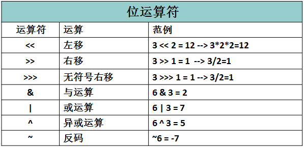

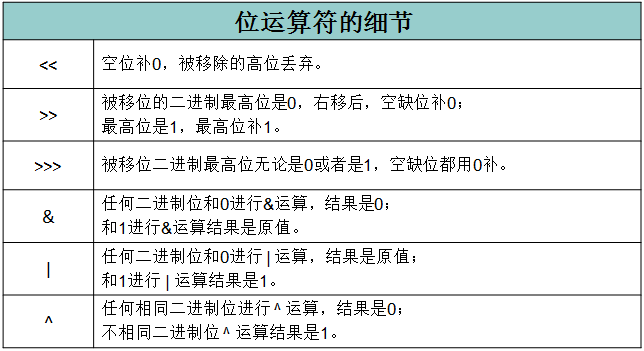

```java
/*
	位运算符：
		&,|,^,~
		<<,>>,>>>

	注意：
		要做位运算，首先要把数据转换为二进制。
*/
class OperatorDemo {
	public static void main(String[] args) {
		//&,|,^,~

		int a = 3;
		int b = 4;

		System.out.println(3 & 4);
		System.out.println(3 | 4);
		System.out.println(3 ^ 4);
		System.out.println(~3);
	}
}
/*
	分析：因为是位运算，所以我们必须先把数据换算成二进制。

	3的二进制：11
		00000000 00000000 00000000 00000011
	4的二进制：100
		00000000 00000000 00000000 00000100

	&位与运算：有0则0。
		00000000 00000000 00000000 00000011
	    &00000000 00000000 00000000 00000100
		-----------------------------------
		00000000 00000000 00000000 00000000
		结果是：0

	|位或运算：有1则1。
		00000000 00000000 00000000 00000011
	    |00000000 00000000 00000000 00000100
		-----------------------------------
		00000000 00000000 00000000 00000111
		结果是：7

	^位异或运算：相同则0，不同则1。
		00000000 00000000 00000000 00000011
	    &00000000 00000000 00000000 00000100
		-----------------------------------
		00000000 00000000 00000000 00000111
		结果是：7

	~按位取反运算符：0变1，1变0
		00000000 00000000 00000000 00000011
	   ~11111111 11111111 11111111 11111100 (补码)

	   补码：11111111 11111111 11111111 11111100
	   反码：11111111 11111111 11111111 11111011
	   原码：10000000 00000000 00000000 00000100
	   结果是：-4
*/
```

## 7.7 三目运算符

- 格式：(关系表达式)?表达式 1：表达式 2；
  - 如果条件为 true，运算后的结果是表达式 1；
  - 如果条件为 false，运算后的结果是表达式 2；
- 示例：获取两个数中大数。

```java
int x=3，y=4，z;
z = (x>y)?x：y；//z变量存储的就是两个数的大数。
```

## 7.8 运算符的优先级

在对一些比较复杂的表达式进行运算时，要明确表达式中所有运算符参与运算的先后顺序，把这种顺序称作运算符的优先级。

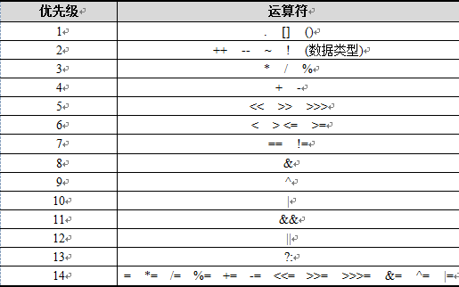

## 7.9 Math

Math 类提供了常用的一些数学函数，如：三角函数、对数、指数等。一个数学公式如果想用代码表示，则可以将其拆分然后套用 Math 类下的方法即可。

```java
Math.abs(12.3);                 //12.3 返回这个数的绝对值
Math.abs(-12.3);                //12.3

Math.copySign(1.23, -12.3);     //-1.23,返回第一个参数的量值和第二个参数的符号
Math.copySign(-12.3, 1.23);     //12.3

Math.signum(x);                 //如果x大于0则返回1.0，小于0则返回-1.0，等于0则返回0
Math.signum(12.3);              //1.0
Math.signum(-12.3);             //-1.0
Math.signum(0);                 //0.0


//指数
Math.exp(x);                    //e的x次幂
Math.expm1(x);                  //e的x次幂 - 1

Math.scalb(x, y);               //x*(2的y次幂）
Math.scalb(12.3, 3);            //12.3*2³

//取整
Math.ceil(12.3);                //返回最近的且大于这个数的整数13.0
Math.ceil(-12.3);               //-12.0

Math.floor(12.3);               //返回最近的且小于这个数的整数12.0
Math.floor(-12.3);              //-13.0

//x和y平方和的二次方根
Math.hypot(x, y);               //√（x²+y²）

//返回概述的二次方根
Math.sqrt(x);                   //√(x) x的二次方根
Math.sqrt(9);                   //3.0
Math.sqrt(16);                  //4.0

//返回该数的立方根
Math.cbrt(27.0);                //3
Math.cbrt(-125.0);              //-5

//对数函数
Math.log(e);                    //1 以e为底的对数
Math.log10(100);                //10 以10为底的对数
Math.log1p(x);                  //Ln（x+ 1）

//返回较大值和较小值
Math.max(x, y);                 //返回x、y中较大的那个数
Math.min(x, y);                 //返回x、y中较小的那个数

//返回 x的y次幂
Math.pow(x, y);
Math.pow(2, 3);                 //即2³ 即返回：8

//随机返回[0,1)之间的无符号double值
Math.random();

//返回最接近这个数的整数,如果刚好居中，则取偶数
Math.rint(12.3);                //12.0
Math.rint(-12.3);               //-12.0
Math.rint(78.9);                //79.0
Math.rint(-78.9);               //-79.0
Math.rint(34.5);                //34.0
Math.rint(35.5);                //36.0

Math.round(12.3);               //与rint相似，返回值为long

//三角函数
Math.sin(α);                    //sin（α）的值
Math.cos(α);                    //cos（α）的值
Math.tan(α);                    //tan（α）的值

//求角
Math.asin(x/z);                 //返回角度值[-π/2，π/2]  arc sin（x/z）
Math.acos(y/z);                 //返回角度值[0~π]   arc cos（y/z）
Math.atan(y/x);                 //返回角度值[-π/2，π/2]
Math.atan2(y-y0, x-x0);         //同上，返回经过点（x，y）与原点的的直线和经过点（x0，y0）与原点的直线之间所成的夹角

Math.sinh(x);                   //双曲正弦函数sinh(x)=(exp(x) - exp(-x)) / 2.0;
Math.cosh(x);                   //双曲余弦函数cosh(x)=(exp(x) + exp(-x)) / 2.0;
Math.tanh(x);                   //tanh(x) = sinh(x) / cosh(x);

//角度弧度互换  360°角=2π弧度
Math.toDegrees(angrad);         //角度转换成弧度，返回：angrad * 180d / PI

Math.toRadians(angdeg);         //弧度转换成角度，返回：angdeg / 180d * PI

Math.PI
```
